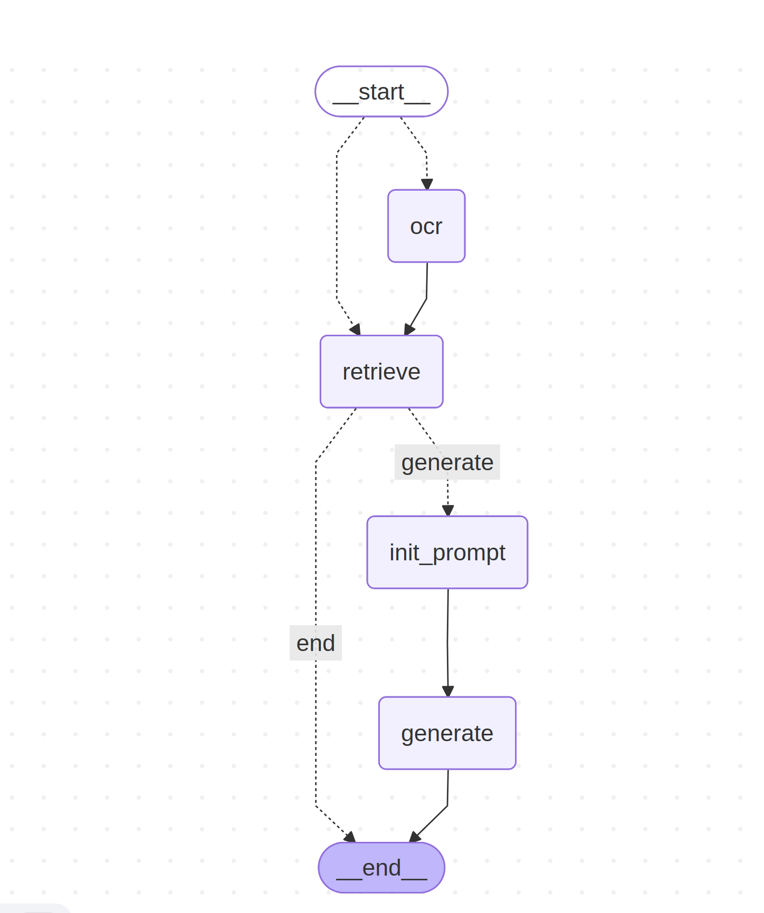
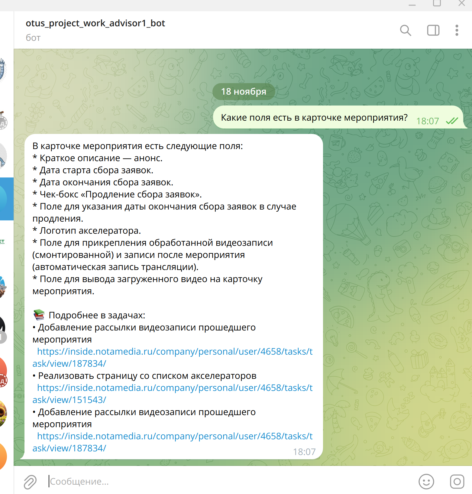
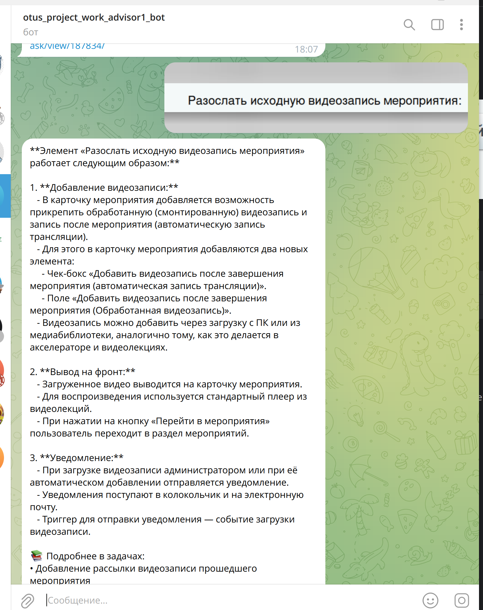
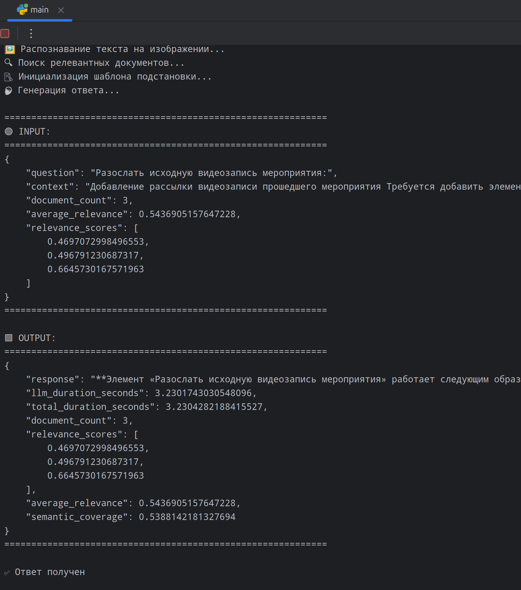
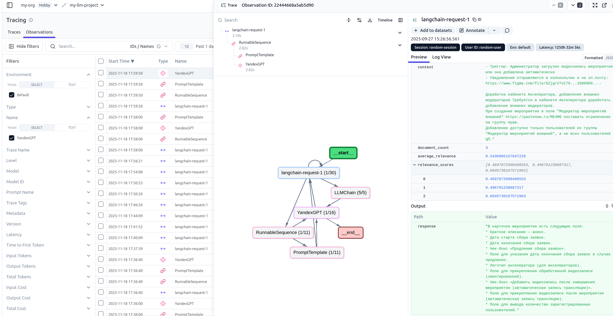

# WorkAdvisor: интеллектуальный ассистент по выполненным работам

# Описание проекта

Этот проект представляет собой интеллектуального Telegram-бота, использующего современные технологии RAG (Retrieval-Augmented Generation), OCR, векторные базы данных и LLM (Large Language Models) для обработки текстовых и изображений-запросов. Бот способен отвечать на вопросы, опираясь на внутреннюю базу знаний, а также распознавать текст с изображений и генерировать по нему ответы.

Проект построен по модульному принципу. 

Основные компоненты:

* main.py - Точка входа: обработка входящих сообщений от Telegram
* src/bot/ - Бот
* src/graph_service.py - Оркестрация логики обработки запроса (State Graph)
* src/rag_service.py - Поиск релевантных документов
* src/llm_service.py - Генерация ответа с помощью LLM
* src/ocr_service.py - Распознавание текста на изображениях
* src/embedding_service.py - Генерация эмбеддингов через Yandex Cloud
* src/clickhouse_service.py -  Хранение и поиск по векторам (эмбеддингам)
* src/prompt_service.py - Управление шаблонами промптов
* src/semantic_coverage_service.py - Оценка качества ответа (насколько он покрывает контекст)


## Как работает система

1. `main.py` — Приём и маршрутизация запросов
Файл main.py — это точка входа, которая:

* Получает обновления от Telegram (через webhook или polling).
* Проверяет, что сообщение от доверенного пользователя (dmitry_plus).
* Определяет тип контента: текст или фото.
* Формирует начальное состояние GraphState.
* Запускает GraphService для обработки.
* Отправляет ответ в чат.

Режимы работы:

Если прислано изображение, извлекается base64-данные и передаётся в граф.

Если прислан текст, он сразу становится query.

2. `src/graph_service.py` — Граф обработки запроса
Граф построен с использованием LangGraph — библиотеки для построения stateful-агентов.


Структура состояния

```json
{
    "query": str,           // Текст запроса
    "relevants": list,      // Найденные документы
    "context": str,         // Объединённый текст документов
    "response": str,        // Готовый ответ
    "image_data": str,      // base64 изображения
    "prompt_template": PromptTemplate
}
```

* route_image_or_query - Если есть изображение → ocr, иначе → retrieve
* ocr - Распознаёт текст с изображения через OCRService и записывает в query
* retrieve - Ищет релевантные документы через RAGService
* init_prompt - Загружает нужный шаблон промпта (в зависимости от типа запроса)
* generate - Генерирует ответ через LLMService
* decide_to_generate - Проверяет, есть ли ошибка или уже ответ — если да, завершает граф

## Визуализация графа



3. `src/ocr_service.py` — Распознавание текста

* Использует Yandex Cloud Vision OCR API.
* Принимает base64-изображение.
* Поддерживает русский и английский языки.
* Работает с рукописным текстом (model: "handwritten").
* Возвращает распознанный текст, который становится новым query.

4. `src/rag_service.py` — Поиск по базе знаний
Реализует RAG-подход:

Подготовка данных:

* Документы загружаются из DataFrame (например, CSV с задачами).
* Текст разбивается на чанки (RecursiveCharacterTextSplitter).
* Каждый чанк векторизуется через YandexEmbeddingService.
* Сохраняется в ClickHouse с метаданными (id, title, url, text, embedding).

Поиск:

* Запрос векторизуется.
* Ищутся ближайшие по косинусному расстоянию документы.
* Формируется context из текста найденных чанков.

5. `src/embedding_service.py` — Генерация эмбеддингов

Использует Yandex Cloud ML SDK.

Два типа моделей:

* doc — для векторизации документов.
* query — для векторизации поисковых запросов.

Эмбеддинги используются в поиске и оценке качества.

6. `src/clickhouse_service.py` — Векторная база данных

Использует ClickHouse как векторное хранилище.
Таблица tasks_clickhouse содержит:

`id, title, url, text, embedding`

Поддерживает поиск по косинусному расстоянию: cosineDistance(embedding, [...]).

7. `src/llm_service.py` — Генерация ответа

Использует YandexGPT через langchain_community.llms.YandexGPT.

Цепочка: PromptTemplate → LLM.

Поддержка Langfuse для:

* Логирования запросов/ответов.
* Мониторинга времени выполнения.
* Оценки качества (через semantic_coverage).

В ответ добавляется ссылка на источники (формируются из метаданных)

8. `src/prompt_service.py` — Управление промптами

Загружает шаблоны из файлов:

* `prompts/answer_from_documents.txt` — для текстовых запросов.
* `prompts/text_from_image_to_query.txt` — для запросов с изображений.

Поддерживает передачу шаблона напрямую (для тестов).

Возвращает PromptTemplate из LangChain.

9. `src/semantic_coverage_service.py`— Оценка качества ответа

Рассчитывает семантическое покрытие:

* Усредняет эмбеддинги релевантных документов → context_embedding.
* Получает эмбеддинг ответа → response_embedding.
* Считает косинусное сходство между ними.
* Результат: число от 0 до 1 (чем ближе к 1 — тем лучше ответ отражает контекст).

# Процесс запуска проекта

### Создаем .env файл

Копируем файл `.env.template` в `.env` и заполняем переменные окружения.

### Запускаем clickhouse сервер
```shell
docker run -d --rm --network=host --name otus-project-clickhouse --ulimit nofile=262144:262144 clickhouse
```

### Запускаем сборку RAG
```shell
.venv/bin/python rag_create.py 
```

### Запускаем телеграм-бот
```shell
.venv/bin/python main.py 
```


# Скрины с демонстрацией работы проекта

## Текстовый запрос в телеграм-бот


## Запрос в виде картинки в телеграм-бот


## Результат выполнения кода в консоли при текстовом запросе


## Результат выполнения кода в консоли при запросе картинкой


## Экспорт данных мониторинга в langfuse
